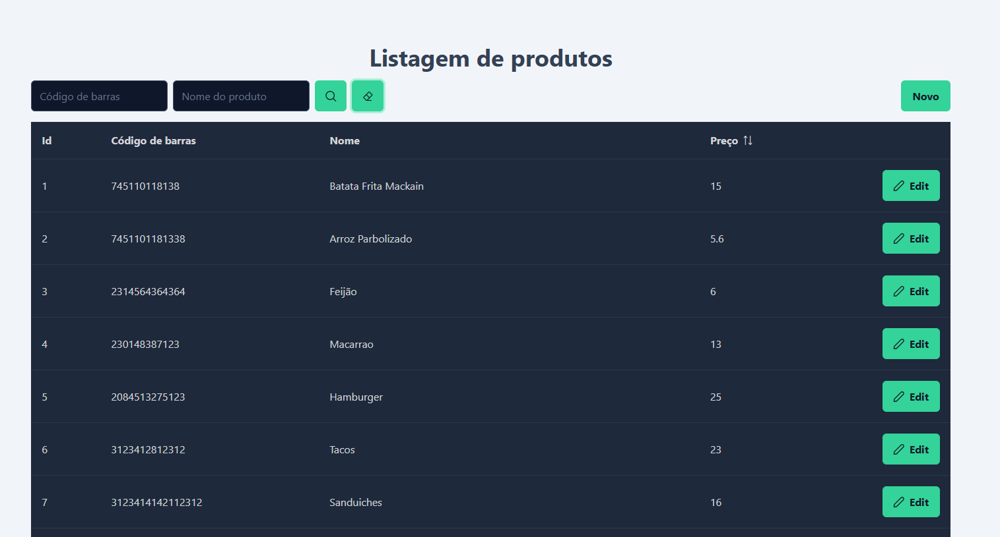

# AVALIAÇÃO TÉCNICA - VUE/.NET – LINX/STONE

Listagem de produtos

# API

## Entre no diretório da API

``
cd Food.API
`` 

## Restaure as dependências

``
dotnet restore
``

## Compile o projeto

``
dotnet build
``

## Aplique as migrations

``
dotnet ef database update
``

Caso não possua a CLI do Entity Framework, é possível aplicar pelo Console do Gerenciador de Pacotes do Visual Studio utilizando o seguinte comando: 

``
UPDATE-DATABASE
``

## Inicie o projeto
``
dotnet run
``

# Cliente

## Entre no diretório do cliente

``
cd Food.Client
`` 

## Instale as dependências

``
npm install
`` 

## Preenchar o arquivo .env com a URL da api

VITE_API_BASE_URL="https://localhost:7077/api/"

## Inicie o Projeto

``
npm run dev
`` 